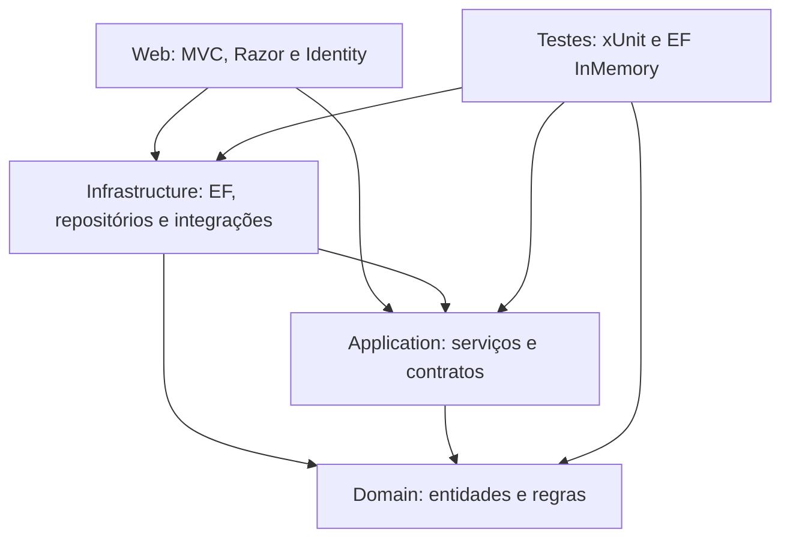

> **Registro da versão original, anterior às correções.** Os defeitos e os 105 testes descritos abaixo pertencem à análise inicial. Para o estado atual, consulte [alterações](../docs/ALTERACOES.md) e [validação atualizada](validacao-atualizada.md). Referências de linhas podem ter mudado. Os scripts DOM incluídos no ZIP validam a versão corrigida; não reproduzem mais a falha antiga.

# NeuroCare — mapa técnico para futuras modificações

## Resultado e escopo

Os anexos permitiram montar e estudar a solução inteira: Domain, Application, Infrastructure, Web, testes e documentação. O arquivo `neurocare.rar` contém `docs/` e `tests/`; os outros quatro arquivos compactados contêm as respectivas camadas. Não houve fontes sobrepostos entre esses arquivos. Os sete anexos iniciais completam a raiz da solução.

A cópia organizada está em `/workspace/neurocare-review/project`. Os arquivos originais extraídos estão em `source-web/` e `source-layers/`, no mesmo diretório de análise. Artefatos `bin/` e `obj/` enviados nos anexos foram preservados nas extrações, mas excluídos da cópia usada para compilação, evitando depender de resultados de outra máquina.

**Validação atual:** restore concluído; solução compilada com **0 avisos e 0 erros**; **105 testes aprovados, 0 falhas e 0 ignorados**. A camada Web foi iniciada para verificações HTTP locais e encerrada depois. Banco SQL Server, migrations aplicadas, autenticação com senha, SMTP e navegação completa não foram validados em execução.

Foram comparados **185 arquivos originais** com a cópia organizada: nenhum foi alterado. O repositório `/workspace/myworld` também permanece sem alterações. Instruções nos anexos foram tratadas como documentação a examinar, sem executar propostas de exclusão de banco ou mudança de framework.

## Arquitetura confirmada nos projetos



| Camada | Responsabilidades observadas | Principais pontos de entrada |
| --- | --- | --- |
| Domain | Entidades, enums, CPF, transições de consultas e medicamentos, assinatura lógica de SOAP | `Appointment.cs`, `Clinical.cs`, `ClinicalScales.cs`, `NotificationsAndPrivacy.cs` |
| Application | Casos de uso, DTOs, validação, autorização, interfaces de persistência e integrações | `AccessGuard.cs`, `ClinicalContext.cs`, serviços por módulo |
| Infrastructure | EF Core SQL Server, Identity, repositórios, migrations, arquivos locais, SMTP, relógio e worker | `DependencyInjection.cs`, `NeuroCareDbContext.cs`, `DbInitializer.cs`, `ReminderWorker.cs` |
| Web | Inicialização HTTP, controllers, APIs de leitura, views Razor, CSS e JS | `Program.cs`, `Controllers/`, `Views/`, `wwwroot/` |
| Tests | Testes de domínio, serviços e persistência em memória; fakes de usuário, relógio, Identity e arquivos | `TestSupport.cs` e nove arquivos de suítes |

Domain não declara pacotes externos. Application referencia Domain e abstrações de DI/logging, sem EF. Infrastructure referencia Application/Domain. Web referencia Application/Infrastructure e tem acesso transitivo a Domain. AccountController usa diretamente UserManager e SignInManager; a separação por serviços não é absoluta na autenticação.

Há 100 arquivos C# fora de `bin/obj`: 12 Domain, 34 Application, 19 Infrastructure, 25 Web e 10 testes. A Web contém 20 classes de controllers, 56 views/partials, cinco scripts próprios e dois arquivos CSS.

## Tecnologias e dependências

- `Directory.Build.props`: `net10.0`, nullable e implicit usings habilitados; `LangVersion=latest`.
- Interface renderizada no servidor: ASP.NET Core MVC e Razor, Bootstrap **5.3.3**, Chart.js **4.4.3** via jsDelivr; JavaScript próprio sem SPA identificada.
- Persistência: EF Core SQL Server; IDs Guid; Identity com `ApplicationUser.OrganizationId`, nome completo e flag Active.
- Pacotes Microsoft declarados com versões flutuantes `10.0.*`; testes usam Test SDK `17.*`, xUnit `2.9.*`, runner `3.*` e EF InMemory `10.0.*`.
- Na verificação, SDK **10.0.401**; EF Core/Identity **10.0.12**. O SDK foi instalado fora dos fontes, com SHA-512 conferido contra metadados oficiais da Microsoft.
- As versões resolvidas desta execução foram registradas em [resolved-package-versions.json](resolved-package-versions.json). Essa lista é evidência da execução, não um lockfile usado pelo restore.

## Inicialização e configuração

`Program.cs` registra Application e Infrastructure, resolve o usuário pelas claims e configura Identity, políticas, MVC, antiforgery, limitação de requisições, health check e middleware. A cultura é `pt-BR`. `BrazilClock` converte entre UTC e `America/Sao_Paulo`, com alternativa de identificador Windows e fallback UTC−3.

`AddInfrastructure` exige `ConnectionStrings:DefaultConnection` e ativa `EnableRetryOnFailure` no SQL Server. Fora de Development, `App:PublicBaseUrl` também é obrigatória. O perfil HTTPS local usa 7180/5180; a imagem Docker serve HTTP na 8080.

`Database:AutoInitialize=true` chama `DbInitializer` antes de iniciar o servidor. **A implementação usa exclusivamente `MigrateAsync`; não há fallback para EnsureCreated.** O inicializador tenta até dez vezes com pausa de cinco segundos, cria os papéis e executa o seed quando habilitado. Erro SQL 2714, de objeto já existente, é tratado como falha de migration e não repetido.

Foi fornecida uma única migration, `20261002232309_Etapa5NotificationsQuestionnairesLgpd`, que cria **23 tabelas**, incluindo Identity e todos os módulos anteriores. Portanto, apesar do nome, ela funciona como migration inicial completa. Aplicá-la a um banco já criado sem histórico correspondente pode conflitar com tabelas existentes. Não foi aplicada a nenhum banco nesta análise.

O Compose local inclui SQL Server 2022, web, volumes de banco e uploads, ambiente Development, seed e e-mails por log. `depends_on` não inclui healthcheck, mas o inicializador possui espera/repetição; a ausência de healthcheck isoladamente não comprova falha de startup.

## Autenticação, papéis e isolamento

Identity exige senha de dez caracteres com maiúscula, minúscula, número e símbolo, e-mail confirmado e e-mail único. Cinco tentativas inválidas causam bloqueio por quinze minutos. O cookie dura oito horas com renovação, HttpOnly e SameSite Lax; Secure é obrigatório fora de Development. O validador de SecurityStamp roda a cada **dez minutos**.

O login verifica usuário ativo e organização ativa; redirecionamentos usam apenas URLs locais. Recuperação de senha usa resposta visual genérica e token codificado em Base64Url. O convite usa o mesmo fluxo de redefinição e confirma o e-mail após definir a senha. Desativação de usuário e organização atualiza SecurityStamp para revogar sessões.

| Acesso na Web | Papéis exigidos |
| --- | --- |
| Organizações | Administrator |
| Usuários da clínica | ClinicAdmin |
| Dashboard, pacientes e gestão de consultas | Doctor ou ClinicAdmin; Home adapta a página ao papel |
| Evoluções SOAP e relatórios | Doctor |
| Medicamentos | Doctor e Patient para leitura; alterações somente Doctor |
| Sintomas, crises, quedas, questionários, documentos e timeline | Doctor ou Patient; exclusão lógica de documentos somente Doctor |
| Editor de questionários da clínica | Doctor ou ClinicAdmin |
| Portal, consentimentos e exportação LGPD | Patient |
| API de pacientes | Política ClinicalStaff: Doctor ou ClinicAdmin |
| API de consultas | Usuário autenticado; serviço limita aos papéis e recursos permitidos |

O tenant vem da claim `neurocare:org`, exposta por `CurrentUser`. `NeuroCareDbContext` aplica filtros de organização a 14 entidades clínicas/operacionais. Sem organização, as consultas dessas entidades não retornam dados. `AccessGuard` também verifica papel e organização.

`ClinicalContext.ResolveAsync` ignora o `patientId` solicitado quando o usuário tem papel Patient e resolve o paciente pelo seu UserId. Downloads e resultados de questionários fazem verificação adicional do paciente resolvido versus o paciente do recurso. Os testes existentes exercitam acesso cruzado por organização e por paciente.

A guarda de escrita verifica entidades ITenantEntity em estados **Added e Modified**, quando existe usuário autenticado. Não cobre Deleted e usa o OrganizationId atual, sem comparação com seu valor original. Isso merece atenção ao criar operações de exclusão, transferência entre tenants ou acesso administrativo direto ao DbContext. Não foi identificado nem testado um endpoint que explore essa lacuna.

## Fluxos principais

**Cadastro de paciente:** view Razor → PatientsController → PatientService → validações de DTO, CPF, nascimento, unicidade por organização e médico responsável → PatientRepository → EF → auditoria por metadados. CPF é mascarado nos DTOs de exibição.

**Consulta:** AppointmentsController → AppointmentService → paciente e médico ativos, horário futuro quando aplicável, duração e conflito de agenda → entidade Appointment → transição de estado → persistência e auditoria. O paciente só lista as próprias consultas. A detecção de sobreposição é uma consulta antes de gravar; concorrência entre requisições não é coberta pelos testes atuais.

**Evolução SOAP:** médico cria rascunho com ao menos uma seção preenchida. Somente o autor edita/assina. Depois de assinar, o serviço impede edição e aceita adendos por médicos da organização. A assinatura é lógica, com autor/data, sem certificado. As entidades possuem setters públicos; futuras gravações diretas no DbContext devem preservar essas regras.

**Medicamentos:** médicos criam e atualizam, com bloqueio de duplicidade de nome em registros não finalizados. Estados Active, Suspended e Finished têm transições no domínio. Pacientes somente consultam. O serviço já valida e grava ReminderEnabled/ReminderTimes, embora a view de formulário enviada ainda não exponha esses campos.

**Diários:** Symptoms, Seizures e Falls usam ClinicalContext, validam DTOs e horário de ocorrência, gravam autoria e origem paciente/equipe e geram auditoria. Datas clínicas aceitam no máximo cinco minutos no futuro. A interface gera gráficos a partir de atributos `data-*`, evitando scripts inline.

**Questionários:** catálogo interno e definições customizadas por organização convergem em IQuestionnaireDefinitionProvider. O serviço impede aplicação de ClinicianOnly pelo paciente, exige todas as respostas e valida valores das opções. Pontuação é soma; faixa e SafetyFlag são persistidos. Resposta de segurança dispara tentativa de e-mail ao médico responsável após persistência; falha SMTP é registrada e não desfaz a resposta.

**Documentos:** validação de tamanho, assinatura inicial PDF/JPG/PNG e extensão; nome sanitizado; chave gerada com GUIDs da organização/paciente/arquivo; SHA-256 persistido. LocalFileStorage valida a chave e mantém arquivos fora de wwwroot. Download passa pelo serviço autorizado e retorna anexo. Exclusão é lógica, mantendo o arquivo físico. A assinatura de arquivo não equivale a parser completo nem antivírus.

**Relatório e timeline:** consolidam dados por paciente; SOAP só aparece na timeline do médico. Relatório exige Doctor e usa impressão pelo navegador. Algumas consultas possuem limites de 500/1000 registros e a timeline limita o resultado final a 300; são recortes, não um prontuário integral sem limites.

**LGPD:** somente Patient concede/revoga consentimentos e exporta os próprios dados. O serviço usa texto e versão do catálogo do servidor, sem confiar nos campos ocultos enviados pelo cliente. A exportação JSON inclui cadastro, consultas, SOAP, medicações, diários, questionários, metadados de documentos e consentimentos. Não inclui binários dos documentos, credenciais nem adendos SOAP na projeção atual. O acesso ao SOAP pela exportação é diferente da restrição das telas clínicas e deve ser considerado ao alterar esse fluxo.

**Lembretes:** ReminderWorker roda sem sessão HTTP, ignorando filtros de tenant para percorrer organizações. Lembretes de consultas usam uma janela futura configurável; medicações procuram horários locais com tolerância de dois minutos. Consentimento pode ser exigido. NotificationDispatch possui índice único da ocorrência para deduplicação e estados Pending/Sent/Failed. Alertas de segurança seguem outro caminho, sem registro de dispatch nesse serviço.

## Pontos encontrados para futuras correções

### Reproduzido em execução isolada

**Mostrar senha no login falha.** [Login.cshtml:148](../src/NeuroCare.Web/Views/Account/Login.cshtml:148) usa `data-toggle-password` vazio, enquanto [password-toggle.js:10](../src/NeuroCare.Web/wwwroot/js/password-toggle.js:10) o passa como seletor a `document.querySelector`. A execução gera SyntaxError antes de registrar o clique. O mesmo script funciona com o seletor explícito de ResetPassword. O CSS do login espera a classe `is-visible` e ícones SVG; o script usa emojis/textContent, portanto a futura correção precisa compatibilizar também a apresentação. Nenhuma correção foi aplicada.

### Confirmado pela leitura dos fontes, sem reprodução funcional completa

1. **Editar medicamento pode desativar seus lembretes.** `_Form.cshtml` não contém ReminderEnabled/ReminderTimes nem campos ocultos para preservação. O POST recebe novos valores padrão e `MedicationService.Apply` os grava. O caso relevante é editar pelo formulário uma medicação que já tenha lembretes habilitados. Backend, DTO e banco suportam a função; interface está incompleta.
2. **Histórico de questionário customizado não preserva a definição.** ClinicQuestionnaireService.Update altera perguntas/opções sob a mesma chave. QuestionnaireResponse guarda respostas numéricas e resultados, mas não a versão da definição. QuestionnaireService.BuildResult interpreta o registro antigo com as perguntas/opções atuais. Uma futura mudança de questionário deve definir versionamento ou snapshot antes de alterar o conteúdo.
3. **Relatório e timeline ainda usam apenas o catálogo interno para identificar questionários.** Para customizados, ReportService pode mostrar a chave como título e usar a própria pontuação como máximo; TimelineService usa a chave no título. O provider customizado não foi integrado a esses pontos nem ao título do alerta do dashboard.
4. **Navegação desatualizada.** `_Layout.cshtml` mostra questionários, medicamentos, documentos e relatórios como “em breve” para equipe, embora haja controllers e acesso pelo prontuário do médico. Também não possui links para ClinicQuestionnaires ou Lgpd. As rotas existem, mas não estão expostas no menu principal.
5. **Validação de upload no cliente está desconectada.** `upload-check.js` procura `data-max-bytes`, mas Upload.cshtml não declara esses atributos nem carrega o script. O limite do servidor permanece implementado; o feedback antecipado descrito no script não é usado nessa tela.
6. **Impressão sem regras próprias.** Reports/Index usa `no-print` e `report-section`, mas não há regras de impressão para essas classes nos CSS enviados. `print.js` apenas chama window.print. A paginação e a inclusão de controles/menu precisam ser avaliadas no navegador antes de alterar o relatório.
7. **Definição de faixas permite lacunas.** ParseBands verifica sobreposição e extremos mínimo/máximo, mas não continuidade entre faixas. Um valor possível no intervalo intermediário pode cair no fallback de BandFor. Avaliar se o produto deseja exigir cobertura contínua.
8. **Rate limit compartilhado.** A política `login` usa AddFixedWindowLimiter, dez requisições por minuto, sem partição por usuário/IP, e é compartilhada por login, recuperação e redefinição. Isso limita o conjunto de clientes atendidos pela instância; não é um limite independente por usuário.
9. **Regras operacionais dos lembretes.** O worker não filtra organização ativa nem PatientStatus; o consentimento considera a finalidade e status, sem exigir a versão atual do catálogo. Envio e gravação de Sent não são atômicos, então uma falha entre esses passos pode produzir duplicata. Há limites de 1000 consultas e 5000 medicações sem paginação/ordenação explícita. Validar essas escolhas antes de escalar ou mudar agendamento.
10. **Textos de alerta customizado.** A tela de resultado trata qualquer SafetyFlag como pensamentos de se ferir, embora o editor permita definir qualquer pergunta de segurança. Se houver instrumentos com outros significados, será necessário transportar a finalidade/mensagem da definição, preservando o comportamento do PHQ-9.

O código de consentimentos e questionários também depende de validação de coleção no serviço: DtoValidator não valida recursivamente os itens, e o model binding MVC possui validação própria. Alterações em DTOs aninhados devem considerar os dois caminhos.

## Documentação que diverge da implementação

- README afirma ausência de compilação e migrations e descreve EnsureCreated; esta análise compilou a versão enviada, encontrou migration completa e confirmou MigrateAsync.
- README combina cabeçalho de Etapa 1 com módulos até Etapa 5 e lista como pendentes recursos existentes.
- O dashboard informa que o sistema não contata o paciente automaticamente; há lembretes por e-mail e envio de alerta ao médico em caminhos separados. É preciso distinguir o texto do alerta clínico do comportamento dos lembretes.
- SECURITY.md fala em revogação de sessão em até um minuto; Program.cs configura intervalo de dez minutos.
- A configuração de LogEmailSender depende de Email:UseLogSender, sem uma guarda de ambiente na seleção. A restrição a desenvolvimento é documental; o código não impede habilitar essa opção em outro ambiente.

Essas divergências não foram corrigidas, para manter os arquivos fornecidos intactos.

## Evidências de verificação

| Verificação | Resultado | Limite |
| --- | --- | --- |
| Restore NeuroCare.sln | Sucesso nos cinco projetos | Versões flutuantes resolvidas nesta execução |
| Build Debug, sem novo restore, paralelismo 2 | 0 avisos, 0 erros | Não equivale a teste de publicação Docker/produção |
| xUnit, artefatos compilados nesta execução | 105 executados, 105 aprovados, 0 falhas/ignorados | EF InMemory e fakes; sem SQL Server real |
| Cinco scripts próprios, node --check | Todos com sintaxe válida | Sintaxe não garante comportamento de interface |
| Mostrar senha, duas verificações DOM com jsdom | Falha do login reproduzida; alternância do reset confirmada | Fragmentos reais das views, sem renderizar Razor no jsdom |
| GET login e recuperação | HTTP 200; campos, antiforgery e CSP presentes no login | Não houve autenticação com senha |
| CSS login, JS senha e imagem de fundo | HTTP 200 | Não mede responsividade ou renderização visual |
| APIs pacientes e consultas sem autenticação | HTTP 401 | Não testa retorno autenticado nem SQL |
| Comparação dos fontes com originais | 185 arquivos iguais | Saídas de build/cache foram geradas separadamente |

Resultado detalhado dos testes: [neurocare-tests.trx](test-results/neurocare-tests.trx). Verificação DOM reproduzível: [check-password.cjs](browser-check/check-password.cjs).

As 105 execuções cobrem CPF e domínio, pacientes, consultas, organização/usuários, isolamento/autorização, SOAP, medicamentos, sintomas/crises/quedas, questionários do catálogo, documentos, relatório e timeline. Não foram identificadas suítes dedicadas a ClinicQuestionnaireService, LgpdService, SecurityNotificationService ou ReminderWorker. A cobertura dessas extensões da Etapa 5 deve ser considerada em futuras modificações.

Na verificação HTTP, inicialização de banco, seed e notificações foram desabilitados por variáveis temporárias do processo, com conexão local sem senha usada apenas para permitir registro dos serviços. Nenhum banco foi conectado e nenhum e-mail foi enviado. A execução informou uso de chaves Data Protection em memória; cookies/tokens nessa configuração não sobrevivem ao reinício. Isso é uma observação desta instância, não uma validação da implantação final.

## Como retomar o trabalho

1. Usar `/workspace/neurocare-review/project` para o estudo dos fontes organizados. O repositório Git solicitado originalmente continua separado; os anexos não foram importados nem commitados nele.
2. Para mudança visual, começar pela view do módulo, `_Layout`, `_ClinicalHeader` e assets associados; conferir os contratos que JS e CSS compartilham.
3. Para regra de negócio, alterar o serviço correspondente e suas invariantes no domínio; conservar os guards, a resolução do paciente, as validações e os metadados de auditoria.
4. Para alteração de dados, comparar modelo/configurações/snapshot e gerar uma migration apropriada. Não tratar a migration inicial existente como atualização incremental de um banco desconhecido.
5. Executar build e a suíte pertinente; para banco, SMTP, notificações ou interface completa, acrescentar a verificação de integração correspondente.

Comandos executados a partir da raiz organizada:

```bash
export DOTNET_ROOT=/workspace/neurocare-review/dotnet
export DOTNET_CLI_HOME=/workspace/neurocare-review/dotnet-cli
export NUGET_PACKAGES=/workspace/neurocare-review/nuget
export DOTNET_CLI_TELEMETRY_OPTOUT=1
cd /workspace/neurocare-review/project
"$DOTNET_ROOT/dotnet" restore NeuroCare.sln --verbosity minimal
"$DOTNET_ROOT/dotnet" build NeuroCare.sln --no-restore --verbosity minimal -maxcpucount:2
"$DOTNET_ROOT/dotnet" test tests/NeuroCare.Tests/NeuroCare.Tests.csproj --no-build --no-restore
```

Este relatório é o contexto técnico persistido para próximas modificações neste ambiente; não presume memória permanente nem publicação da configuração em uma nova tarefa.
